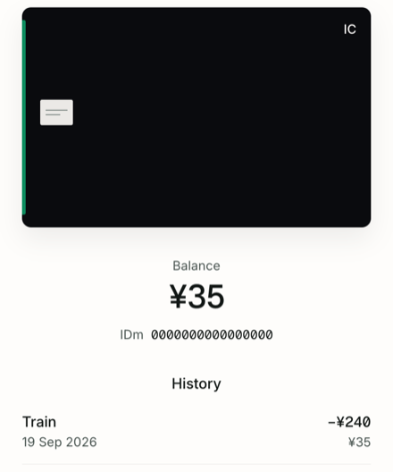

# FelicaWebReader

  
  

  <a href="#about">About</a> •
  <a href="#features">Features</a> •
  <a href="#quick-start--information">Quick Start & Information</a>

## About

You have a Japanese transit card and a Sony PaSoRi on the desk. You want the money left on the card, and the recent trips, on this screen.

You press Connect reader, set the card down, and read the balance. The money on the card stays the same. The screen is in English.

## Features

- You see the balance in yen, and the card number under it.

- You see recent trips. A line says Train, Bus, Top up, Purchase, Ticket, Ticket office, Adjustment, or Trip, plus the date, the amount, and the balance after that trip. A purchase also shows the time. You do not see the station name.

- You leave the card on the reader and the numbers stay current. You lift the card and you see Place the card.

- You open the page again on this computer and skip Connect reader, while the reader stays plugged in.

- On a narrow screen the card, the balance, and the trips stack. On a desk the card sits on the left and the balance sits beside it.

## Quick Start & Information

Plug the Sony PaSoRi RC-S320 into this computer. Open the page in Chrome or Edge. Press Connect reader and allow the reader when the browser asks. Place the card on the reader.

You then see the balance and the trips.

You need Chrome or Edge. The reader has to sit on the same computer as the browser. If another program is already using the reader, close it and press Connect reader again.

---

