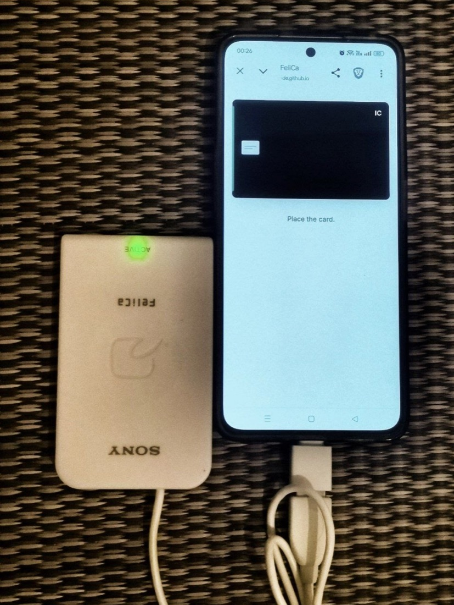
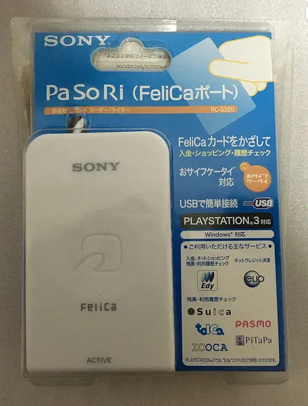

# FelicaWebReader

  
  

  <a href="#about">About</a> •
  <a href="#features">Features</a> •
  <a href="#quick-start--information">Quick Start & Information</a>

## About

Sony PaSoRi IC Card Reader serverless WebUSB implementation for reading Japanese IC transit cards (Suica, PASMO, ICOCA, and similar FeliCa cards) with a Sony PaSoRi reader direct on the web.

## Features

- Fully client-side WebUSB implementation — open the page and connect the reader. No server required.
- Displays the card number and remaining balance in yen.
- Lists recent trips and other purchases.

## Quick Start

1. Plug the Sony PaSoRi reader into your computer.
2. Open https://segocode.github.io/FelicaWebReader/ in Google Chrome or Microsoft Edge... (WebUSB must be available).
3. Click **Connect reader** and allow access when the browser prompts you.
4. Place the IC card on the reader.

> [!WARNING]
> If another application is already using the reader, close that application and click **Connect reader** again.

---

